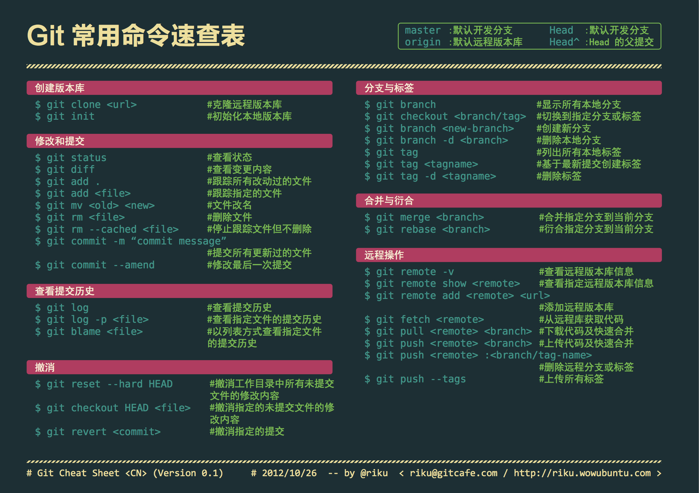

# Linux

常见执行 **Linux** 命令的格式是这样的：

> **命令名称 [命令参数] [命令对象]**

注意：命令名称、命令参数、命令对象之间用空格键分隔

命令对象一般是指要处理的文件、目录、用户等资源，而命令参数可以用长格式（完整的选项名称），也可以用短格式（单个字母的缩写），两者分别用`--`与`-`作为前缀。

## **工作目录切换命令**

### pwd

`pwd` 命令就是 `print working directory` 的缩写，意思是打印当前工作目录

### ls

`ls` 命令就是 `list` 的缩写，用来显示目录内容列表

### cd

`cd` 命令就是 `Change Directory` 的缩写，用来切换当前的工作目录

> 参考资料：
>
> https://cloud.tencent.com/developer/article/1406724 
>
> https://www.w3cschool.cn/git/git-cheat-sheet.html
>
> https://www.jianshu.com/p/46ffff059092
>
> https://www.sohu.com/a/251952125_663371

## Git

## 系统状态

### ifconfig

持续更新中...

